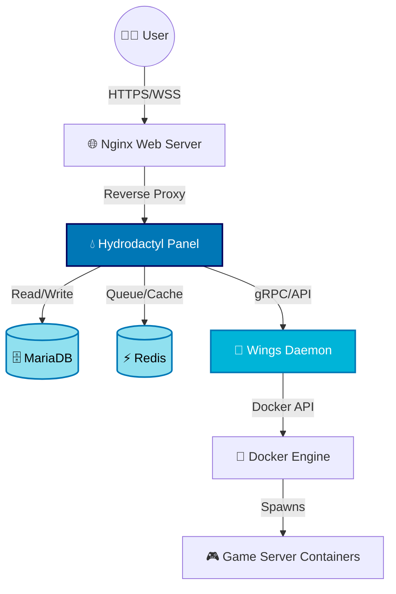

<div align="center">
  
  
  <h1>💧 Hydrodactyl Installer 💧</h1>
  
  <p><b>The official, zero-touch, one-line installation script for Hydrodactyl Panel and Wings.</b></p>
  
  <p>
    
    
    
    
  </p>
</div>

<br>

<div align="center">
  <i>Dive into next-generation server management without the headache of manual setup.</i>
</div>

---

## 🌊 Overview

**Hydrodactyl Installer** is a robust, enterprise-grade automated script designed to deploy the [Hydrodactyl Panel](https://github.com/blueprintframework/hydrodactyl) and its daemon (**Wings**) seamlessly. 

Built and heavily optimized by the **Blueprint Framework** team, this installer takes care of the deep waters: downloading the panel, setting up Nginx, configuring PHP-FPM, initializing MariaDB, bypassing SELinux roadblocks, and configuring background workers—all while you sit back and relax.

## 🚀 Quick Installation

Deploy both the Hydrodactyl Panel and the Wings Daemon on any fresh, supported Linux distribution with a single command.

```bash
bash <(curl -sSL https://raw.githubusercontent.com/MiiuGR4U/hydrodactyl-installer/main/install.sh)
```

### 🎛️ Interactive Menu Features
Upon running the installer, you will plunge into an interactive terminal UI allowing you to:
- 💻 **Install the Hydrodactyl Panel**
- 🦅 **Install the Wings Daemon**
- 🌐 **Install both on the same machine** (Perfect for single-node setups)
- 🔄 **Update existing installations**
- ⚙️ **Configure auto-updaters**

---

## 🧊 Key Features

- **Zero-Touch Node Auto-Configuration:** Automatically connects Wings to your Panel via API. No manual token copying required!
- **Intelligent Pre-Flight Checks:** Scans your RAM, Disk Space, Architecture, and active ports before installing Wings to prevent mid-installation crashes.
- **God-Mode Permissions:** Automatically patches Docker and SELinux volume permission errors (UID 999 sync) natively.
- **SSL / HTTPS Ready:** Built-in Let's Encrypt support using Certbot for secure connections out-of-the-box.
- **Smart Firewall Integration:** Automatically configures `ufw` or `firewalld` to open game server and web ports.

---

## 🗺️ System Architecture

Hydrodactyl relies on a modern, high-performance stack. Here is how the installer wires everything together:



---

## 🛳️ Supported Operating Systems

We support a wide ocean of enterprise and community Linux distributions. **A fresh, newly installed OS is strictly required.**

| OS Family | Distribution | Supported Versions | Architecture |
| :--- | :--- | :--- | :--- |
| 🟠 **Ubuntu** | Ubuntu Server | `20.04`, `22.04`, `24.04` | `amd64`, `arm64` |
| 🔴 **Debian** | Debian | `11`, `12` | `amd64`, `arm64` |
| 🟢 **RHEL** | AlmaLinux / Rocky Linux | `8`, `9` | `amd64`, `arm64` |

> [!WARNING]
> Do not run this script on an OS that already has Apache, existing MySQL instances, or custom web panels (like cPanel/Plesk) installed.

---

## ⚓ Support & Blueprint Framework

This installer is proudly maintained as part of the **Blueprint Framework** ecosystem.

- **Bugs/Issues:** If you encounter issues with this installer script, please open an issue in this repository.
- **Panel Support:** For general support regarding Hydrodactyl, visit our official community or read the documentation.

<br>

<div align="center">
  <i>Made with 💙 and 🌊 by Blueprint.</i>
</div>
